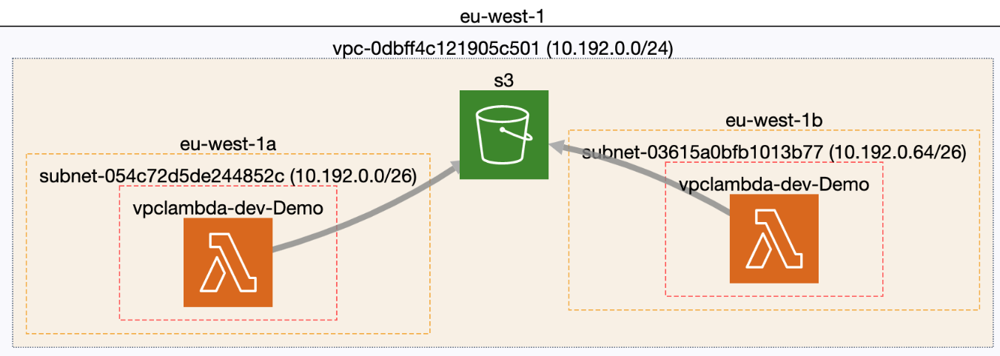

# AWS VPC Lambda with serverless

This repo is the companion to `Breaking down AWS Lambda’s Shared Responsibility model`.

It creates
* An Amazon S3 bucket
* A VPC - 10.192.0.0/24
    * Two private subnets - 10.192.0.0/26 and 10.192.0.64/26
    * Security Groups 
    * A VPC Endpoint for S3
    * VPC Flow Logs to CloudWatch so you can audit the traffic generated
* And of course the Lambda inside the VPC



Diagram - courtesy of [CloudMapper](https://github.com/duo-labs/cloudmapper)

The Lambda will periodically write files to an S3 Bucket.

We're using [serverless](https://www.serverless.com/framework/docs/) to deploy an AWS Lambda inside a VPC. All traffic stays within [AWS PrivateLink](https://aws.amazon.com/privatelink/) using VPC endpoints. The rest of the resources are built using CloudFormation.

A benefit of this pattern - and of the serverless framework - is that we separate the infrastructure from the code/serverless deployment.

## Get Started

### Deploy

```sh
npm install serverless@2.31.0
cd VPCLambda
serverless deploy --stage="dev" -v
```
:tada:

### Remove

You will need to delete the objects from the bucket, otherwise the stack will not be able to delete the bucket.

```sh
serveless remove --stage="dev" -v
```


## Goals

1. A good starting point for working with Lambdas
2. A playground environment

## Non-Goals
- KMS CMKs 
- Exhaustive optimisation 
- Enforcing this model/Landing Zone


## Known Issues

1. If you get an error about PrefixLists, make sure that the [Prefix List](https://eu-west-1.console.aws.amazon.com/vpc/home?region=eu-west-1#ManagedPrefixLists:) for S3, is correct under [PrefixListId](VPCLambda/resources/infrastructure.yml#178). Currently CloudFormation doesn't support getting the PrefixListId and the only solution is to deploy [AWS CloudFormation Lambda-backed Custom Resource for retrieving the PrefixListID](https://github.com/awslabs/aws-cloudformation-templates/blob/master/aws/solutions/PrefixListResource/README.md) which would make this repo a lot more complicated than I intended.